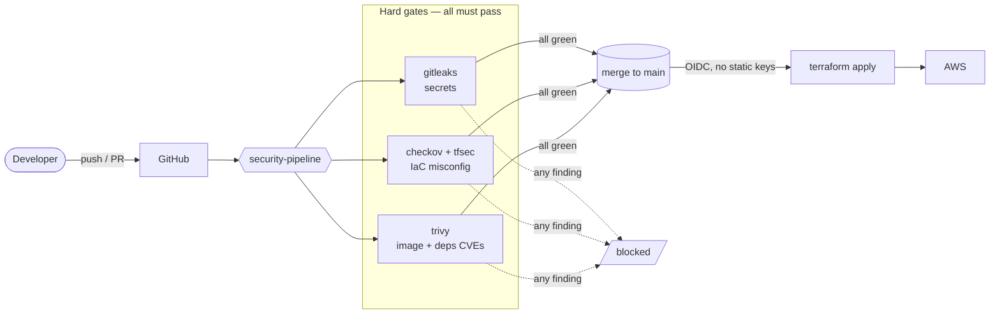
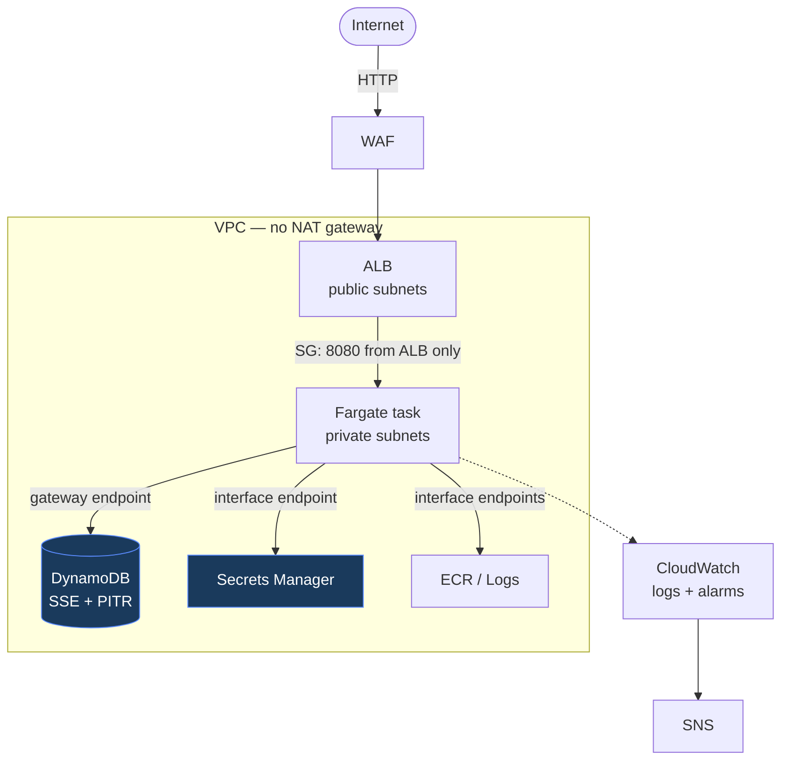

# Architecture

## Pipeline (the DevSecOps gates)

## Runtime (what Terraform deploys)

## The story in one line

**Build** a container → **ship** it only if it passes secrets/IaC/CVE gates → **run** it on Fargate in private subnets, secrets from Secrets Manager, fronted by an ALB + WAF, with no path to the open internet.

## Security posture

- **Nothing insecure merges** — three fail-the-build gates on every PR.
- **No long-lived credentials** — CI authenticates to AWS via GitHub OIDC.
- **No public egress** — private subnets + VPC endpoints (no NAT).
- **App is never internet-reachable** — only the ALB (behind WAF) is public.
- **Least privilege** — the task role can touch only its own DynamoDB table and secret.
- **Secrets never in code or image** — generated and injected from Secrets Manager at runtime.

See [stage2](stage2.md) (infra), and the reviewed scanner baseline in [`.checkov.yaml`](../.checkov.yaml).
